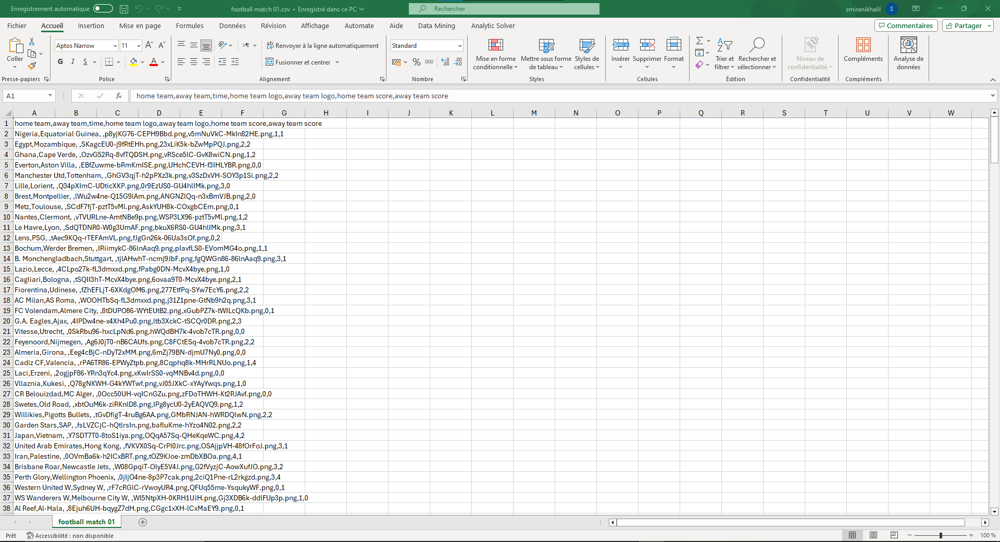

# Football Match Scraper

This script scrapes data about football matches from the website [FlashScore](https://www.flashscore.com/). It allows you to retrieve information about home teams, away teams, match times, home team logos, away team logos, home team scores, and away team scores.

## Requirements

- Python 3.x
- Selenium
- Chrome WebDriver
- Requests
- Pandas

## Setup

1. Install the required Python libraries:

    ```bash
    pip install selenium requests pandas
    ```

2. Download and install the [Chrome WebDriver](https://sites.google.com/chromium.org/driver/).

3. Clone the repository:

    ```bash
    git clone https://github.com/AyoubSmirani7080/Football-Match-Scraper.git
    cd Football-Match-Scraper
    ```
4. Download requiremnts:
 
 pip install -r requirements.txt

5. Run the script:

    ```bash
    python scraper.py
    ```

## Usage

- Enter a date in the format `jj/mm` when prompted.
- The script will then scrape football match data for the provided date and save it to a CSV file.
## Example 


## Structure

- `scraper.py`: The main script that performs the scraping.
- `data`: The directory where the CSV files containing scraped data are saved.

## Acknowledgments

- This script uses Selenium for web scraping and Requests for downloading team logos.

Feel free to contribute and improve the script!
